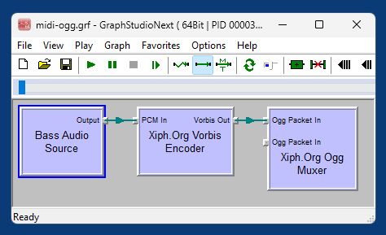

# oggdsf-updated

An updated version of the Xiph.org [oggdsf](https://github.com/xiph/oggdsf) DirectShow filters - [opencodecs_0.85.17777_src.7z](https://www.xiph.org/dshow/downloads/) from 2011 - that can be compiled with recent versions of Visual Studio. 

*Example graph for rendering a MIDI file to Ogg Vorbis using `dsfVorbisEncoder.dll` and `dsfOggMux.dll`*  

## Included Filters
The repository contains all original filters except for the [webmdshow](https://github.com/webmproject/webmdshow) filters.

- dsfFLACDecoder.dll
- dsfFLACEncoder.dll
- dsfNativeFLACSource.dll
- dsfOggDemux2.dll
- dsfOggMux.dll
- dsfSpeexDecoder.dll
- dsfSpeexEncoder.dll
- dsfTheoraDecoder.dll
- dsfTheoraEncoder.dll
- dsfVorbisDecoder.dll
- dsfVorbisEncoder.dll

## Building

[oggdsf.sln](sln/oggdsf.sln) is a Visual Studio 2017 solution that can be imported (migrated) into any later Visual Studio version. There are no additional requirements, everything needed is included. The libraries and filters are by default compiled without MSVC++ runtime dependency (`/MT`).
